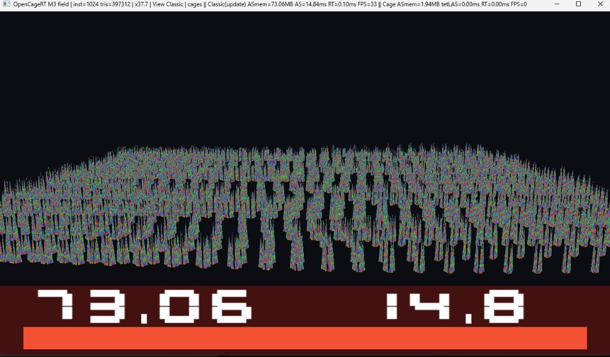
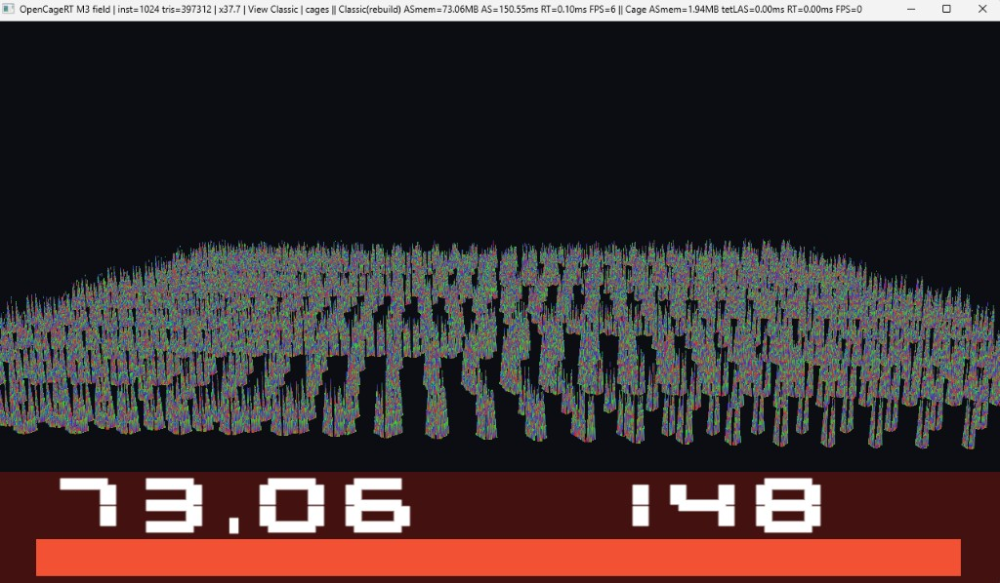
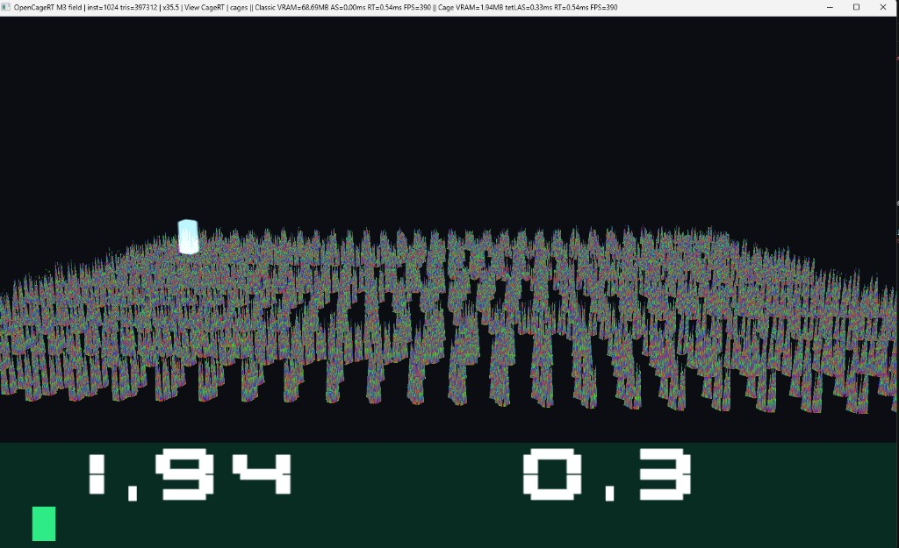
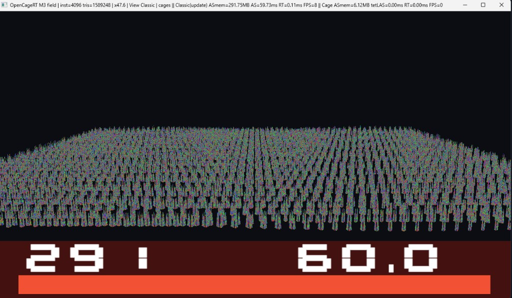
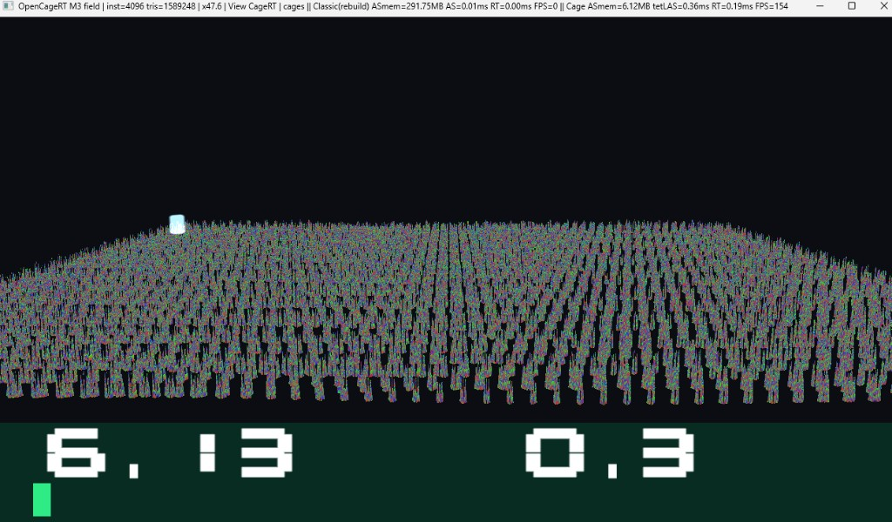
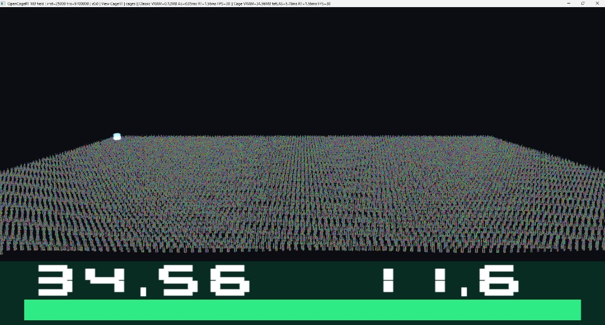
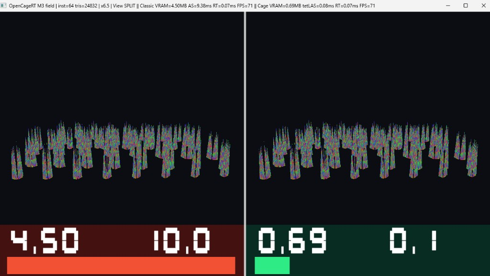
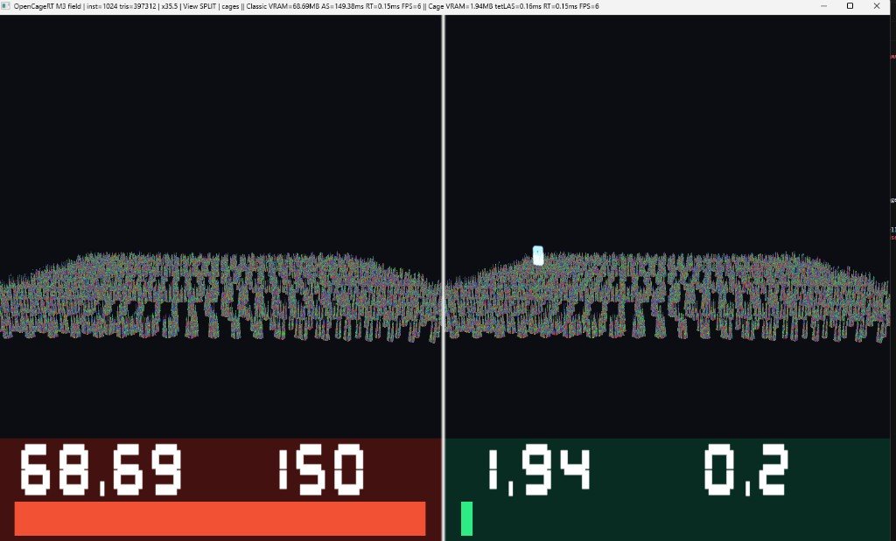

# OpenCageRT

Independent MIT **DXR** demo of tetrahedral-cage animated ray tracing, based on:

> Gruen, Benthin, Kern, McAllister — *Ray Tracing Massive Amounts of Animated Geometry*, HPG 2026, [DOI 10.1145/3820014](https://doi.org/10.1145/3820014).

Not affiliated with AMD GPUOpen.

Same plants. **Classic Rebuild** rebuilds a unique BLAS per instance every frame. **Classic Update** keeps those unique BLASes and refits them with `ALLOW_UPDATE` / `PERFORM_UPDATE`. **CageRT** keeps a **shared set of static μBLASes** and updates tetLAS instance transforms (`A M⁻¹`).

`ASmem` on the HUD is **tracked RT memory** (geometry + acceleration structures the demo owns). It is not the process working-set from Task Manager. DXGI local-adapter usage is logged as a delta in CSV.

## How to reproduce numbers

Interactive captures are not the published method. Clone, build, then:

```powershell
.\OpenCageRTDemo.exe --benchmark --instances 64,1024,4096,25000 --warmup 60 --frames 240 --csv results.csv
.\OpenCageRTDemo.exe --parity
```

`--benchmark` runs three solo paths (Classic Rebuild, Classic Update, CageRT), vsync off, and writes median / p95 plus GPU, driver, resolution, and git hash. Published RTX 3090 rows: [`docs/benchmarks/rtx3090-2026-09-21.csv`](docs/benchmarks/rtx3090-2026-09-21.csv). `--parity` freezes a 64-instance field and compares Classic vs CageRT barycentric RGB (HUD off). Do not quote a speedup unless `--parity` exits 0.

Classic unique BLAS is skipped above 4096 instances (TDR risk). 25k is CageRT-only.

## Measured on RTX 3090

Source: [`docs/benchmarks/rtx3090-2026-09-21.csv`](docs/benchmarks/rtx3090-2026-09-21.csv)  
`--benchmark --warmup 60 --frames 240`, vsync off, HUD/cages off, median (p95 in CSV). Driver 32.0.16.1692. `--parity` passed.

64 plants ran at 1280×720; 1024 / 4096 / 25k at 1920×1009 after the window was maximized. Compare modes inside a rung, not FPS across rungs.

### 1024 plants (flagship)

| Mode            | Tracked RT mem | AS update (median) | RT (median) | FPS (median) |
|-----------------|---------------:|-------------------:|------------:|-------------:|
| Classic Rebuild | 73.06 MB | **150.0 ms** | 0.17 ms | 5.9 |
| Classic Update  | 73.06 MB | **15.7 ms** | 0.17 ms | 31.5 |
| CageRT          | **1.94 MB** | **0.16 ms** | 0.23 ms | **144** |

Against honest DXR **Update/Refit**: **×38** less tracked RT memory, **×96** faster AS update.

Classic Update 1024 (HUD capture; CSV is the published row):



Classic Rebuild 1024:



CageRT 1024 (shared static μBLASes):



### Full ladder (CSV median)

| Instances | Mode            | Tracked RT mem | AS update | FPS |
|----------:|-----------------|---------------:|----------:|----:|
| 64 | Classic Rebuild | 4.81 MB | 9.82 ms | 72 |
| 64 | Classic Update | 4.81 MB | 0.97 ms | 144 |
| 64 | CageRT | 0.69 MB | 0.14 ms | 144 |
| 1024 | Classic Rebuild | 73.06 MB | 150.0 ms | 5.9 |
| 1024 | Classic Update | 73.06 MB | 15.7 ms | 31.5 |
| 1024 | CageRT | 1.94 MB | 0.16 ms | 144 |
| 4096 | Classic Rebuild | 291.75 MB | **592 ms** | 1.5 |
| 4096 | Classic Update | 291.75 MB | 60.4 ms | 8.2 |
| 4096 | CageRT | 6.13 MB | 0.31 ms | 144 |
| 25000 | CageRT | 34.56 MB | 7.66 ms | 28 |

4096 HUD Rebuild (~61 ms) was a bad frame / wrong mode: CSV Rebuild is **592 ms**, Update is **60 ms**. Interactive HUD is not the source of truth. 25k is CageRT-only.

Classic Update 4096:



CageRT 4096:



CageRT 25 000 plants (~9.7M triangles):



Split 64:



Split 1024:



## Keys

| Key | Action |
|-----|--------|
| **S** | Split Classic \| CageRT |
| **C** | Toggle Classic / CageRT fullscreen |
| **U** | Toggle Classic **Rebuild** / **Update (refit)** |
| **1–4** | 64 → 1024 → 4096 → 25k plants |
| **T** | Auto tour for a capture |
| **G / F / R** | Cages / freeze / ray debug |

**4** stays on CageRT. Do not toggle Classic there (TDR risk from tens of thousands of unique BLASes).

## Build (Windows)

VS 2022 Build Tools, Windows SDK 10+, CMake 3.24+, DXR GPU.

```powershell
cmake --preset windows-x64
cmake --build "build/windows-x64" --config Release
ctest -C Release --test-dir build/windows-x64 --output-on-failure
```

Demo: `build/windows-x64/apps/demo/Release/OpenCageRTDemo.exe`

CPU tests run in CI. `--parity` / `--benchmark` need a DXR GPU and are not run on GitHub-hosted runners.

## License

MIT — see [LICENSE](LICENSE).
