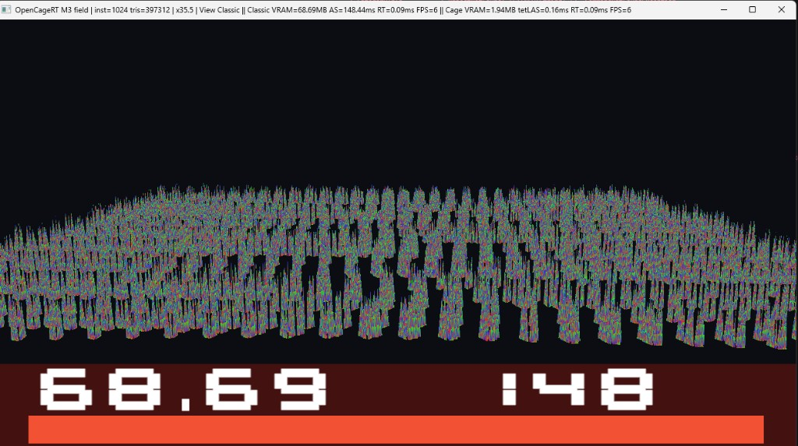

# OpenCageRT

Independent MIT **DXR** demo of tetrahedral-cage animated ray tracing, based on:

> Gruen, Benthin, Kern, McAllister — *Ray Tracing Massive Amounts of Animated Geometry*, HPG 2026, [DOI 10.1145/3820014](https://doi.org/10.1145/3820014).

Not affiliated with AMD GPUOpen.

Same plants. **Classic Rebuild** rebuilds a unique BLAS per instance every frame. **Classic Update** keeps those unique BLASes and refits them with `ALLOW_UPDATE` / `PERFORM_UPDATE`. **CageRT** keeps a **shared set of static μBLASes** and updates tetLAS instance transforms (`A M⁻¹`).

`ASmem` on the HUD is **tracked RT memory** (geometry + acceleration structures the demo owns). It is not the process working-set from Task Manager. DXGI local-adapter usage is logged as a delta in CSV.

## How to reproduce numbers

Interactive captures are not the published method. Clone, build, then:

```powershell
.\OpenCageRTDemo.exe --benchmark --instances 64,1024,4096,25000 --warmup 60 --frames 240 --csv results.csv
.\OpenCageRTDemo.exe --parity
```

`--benchmark` runs three solo paths (Classic Rebuild, Classic Update, CageRT), vsync off, and writes median / p95 plus GPU, driver, resolution, and git hash. `--parity` freezes a 64-instance field and compares Classic vs CageRT barycentric RGB (HUD off). Do not quote a speedup unless `--parity` exits 0.

Classic unique BLAS is skipped above 4096 instances (TDR risk). 25k is CageRT-only.

## Measured on RTX 3090 (Classic Rebuild, previous interactive capture)

These rows predate Classic Update and the CSV harness. Re-run `--benchmark` for the three-column table.

| Mode            | Instances | Tracked RT mem | AS update | RT | FPS (solo) |
|-----------------|----------:|---------------:|----------:|---:|-----------:|
| Classic Rebuild | 64 | 4.50 MB | 9 ms | *combined split* | — |
| CageRT | 64 | 0.69 MB | 0.1 ms | *combined split* | — |
| Classic Rebuild | 1024 | **68.69 MB** | **150 ms** | *combined split* | ~6 |
| CageRT | 1024 | **1.94 MB** | **0.3 ms** | *combined split* | **390** |
| CageRT | 25000 | **34.56 MB** | **11.6 ms** | 1.0 ms | **30** |

Target table after `--benchmark` (fill from `results.csv`):

| Mode            | AS memory | AS update | RT | FPS |
|-----------------|----------:|----------:|---:|----:|
| Classic Rebuild | measured | measured | measured | measured |
| Classic Update  | measured | measured | measured | measured |
| CageRT          | measured | measured | measured | measured |

Split 64 — same field, memory bars:


Split 1024 — Classic Rebuild 68.69 MB vs CageRT 1.94 MB (**x35**):


Classic solo 1024 (unique BLAS rebuild):



CageRT solo 1024 (shared static μBLASes):


CageRT 25 000 plants (~9.7M triangles):


## Keys

| Key | Action |
|-----|--------|
| **S** | Split Classic \| CageRT |
| **C** | Toggle Classic / CageRT fullscreen |
| **U** | Toggle Classic **Rebuild** / **Update (refit)** |
| **1–4** | 64 → 1024 → 4096 → 25k plants |
| **T** | Auto tour for a capture |
| **G / F / R** | Cages / freeze / ray debug |

**4** stays on CageRT. Do not toggle Classic there (TDR risk from tens of thousands of unique BLASes).

## Build (Windows)

VS 2022 Build Tools, Windows SDK 10+, CMake 3.24+, DXR GPU.

```powershell
cmake --preset windows-x64
cmake --build "build/windows-x64" --config Release
ctest -C Release --test-dir build/windows-x64 --output-on-failure
```

Demo: `build/windows-x64/apps/demo/Release/OpenCageRTDemo.exe`

CPU tests run in CI. `--parity` / `--benchmark` need a DXR GPU and are not run on GitHub-hosted runners.

## License

MIT — see [LICENSE](LICENSE).
